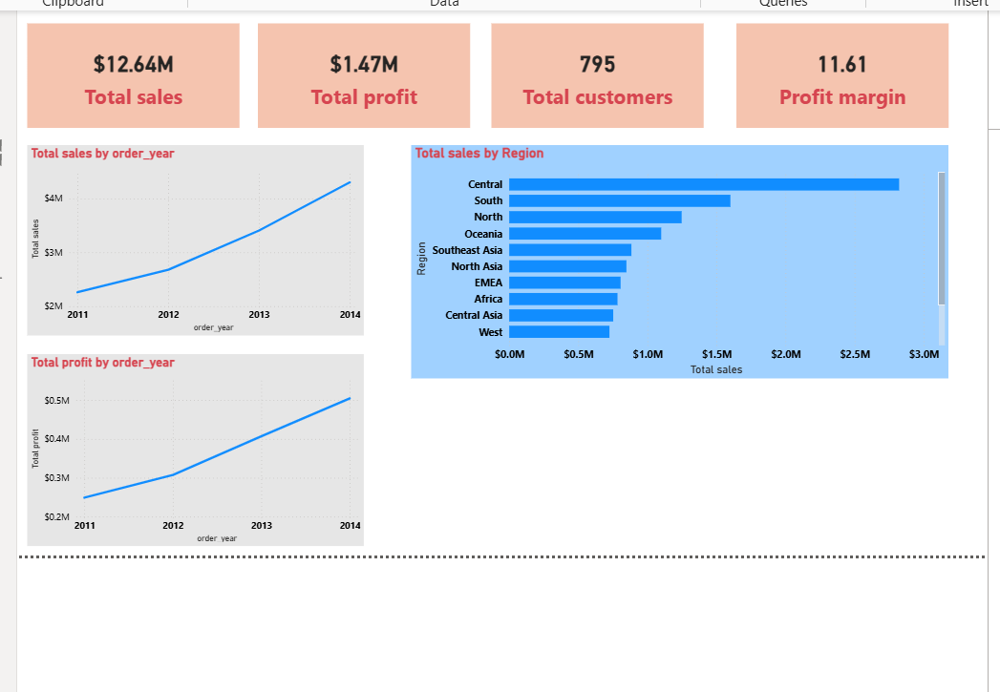
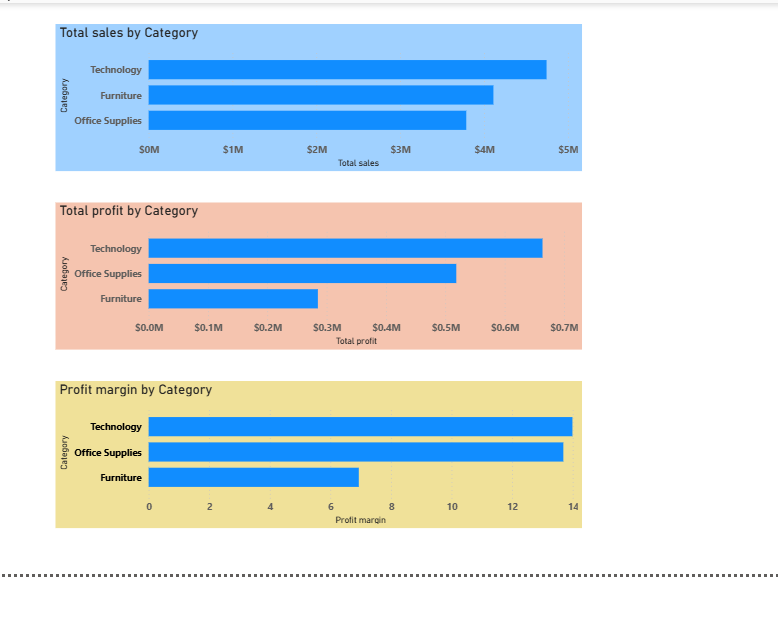
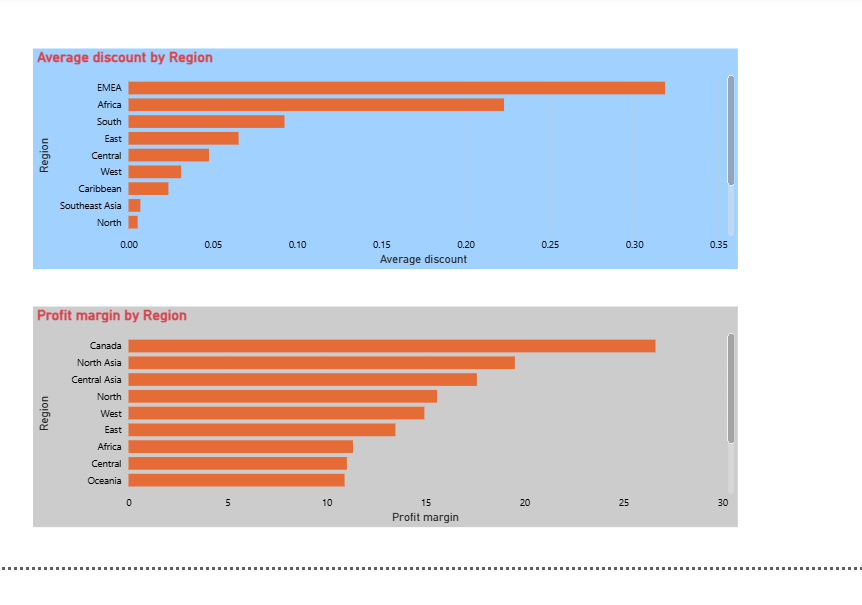
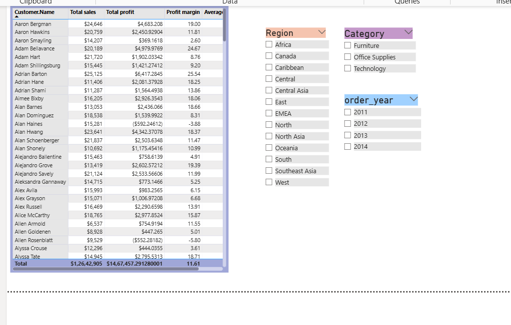

# 📊 Retail Profitability Analysis

## 🔍 Project Overview
This project analyzes retail sales data to identify key drivers of profitability using SQL and Power BI.

---

## 🎯 Objectives
- Analyze sales and profit trends over time
- Identify high and low performing categories
- Evaluate impact of discounts on profitability
- Segment customers based on profitability

## 🛠️ Tools Used
- SQL (MySQL)
- Power BI
- Excel (Data source)

---

## 📂 Project Structure
- dataset → Raw data (Superstore dataset)
- sql → SQL queries for analysis
- dashboard → Power BI dashboard file
- screenshots → Dashboard visuals

---

## 📊 Key Insights
- Technology category has highest profit margin (~14%)
- Furniture has high sales but low profitability (~6%)
- Higher discounts reduce profit margins significantly
-  Some customers generate negative profit due to high discounts

---

## 📈 Dashboard Preview

### Overall Dashboard

### Category Analysis

### Region Analysis

### Customer Analysis

---

## 🚀 How to Use
1. Download dataset from dataset folder
2. Run SQL queries from sql folder
3. Open Power BI file from dashboard folder

---

## 👤 Author
Aaron Rao
  
